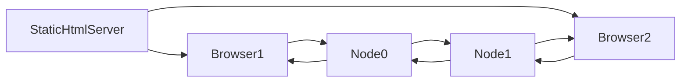

# Pistol Chat Demo

### Quickstart

```
git clone https://github.com/scottburch/pistol-examples.git
cd pistol-examples
yarn
yarn start-demo
```

This will download the code, setup dependencies, start two peer nodes and a dev server to serve the static browser code.  After you run  `yarn start-demo`you will get the addresses for the two browsers to start to chat.  Browser1 will connect to Node0 and Browser2 will connect to Node1.
There is no special code on the nodes.  The chat code is being served statically by a dev server and run in the browsers which are themselves nodes on the network.  The browsers are running the same underlying code as the nodes.



### What is Pistol?

Pistol is a fully peer-to-peer application framework.  There are no central servers or databases.  Data is replicated between nodes and can be delivered from one node to another providing reliability.  Unlike other P2P networks, the end application is also a node on the network.  

**NOTE:  This is an early release of pistol, there is much work to do to make the protocol and storage more efficient.  There are many features to be added.  Use the current version at your own risk in a production environment.**

### Why use Pistol?

**Rapid Development**

Pistol is a great way to get an application up and running quickly (rapid development).  It is also a great solution for proof-of-concept (POC) and working prototype development due to its simple API design.  **With Pistol, you can stop worrying about server communication since all reads and writes are local to the app.** **You can develop a running app without a server at all since the app is a peer in the network.**

If you want to know more about this.  Look at or read more about the demo code below.


**Offline-first Applications**
Since Pistol does not require any server to operate, it is perfect for offline-first applications.


**Collabrative Software**

Pistol is perfect for collabrative software since everyone on the peer-to-peer network is sharing data automatically.


**Censorship Resistance**

Since there is no central authority, only the owner of an application can control what data is stored.  The owner of an application can also choose to release that ability so they can't control access to the application.  It is the choice of the person creating the application.


**Gaming**

Perfect for communication between game instances with them speaking P2P.


**Internet of Things (IoT)**

We are keeping the protocol as light as possible to make it possible to have peers on small low cost devices.


### How does security work without a central authority?

Pistol uses cryptographic proofs similar to the ones used in Bitcoin to verify you are you you say you are.  Pistol has a built in access control mechanism which allows you to say who can modify data.  Currently, users have the ability to own data that they write (first come first own) or to have world writable data.  Many more options are to come including group permissions.

For those familiar with these proofs.  Pistol uses a private/public key pair with cryptographic signing.  It stores the public key in the access control metadata to control who can write.  In the future we will be making this more efficient by having a key repository, but for right now, data has the public keys mixed in with the data.

## Explanation of the chat code

The code base uses RxJS.  If you are not familiar with RxJS or Reactive Functional Programming it may look a little strange.  It is not hard to pick up.  In the future we may add a wrapper to make it easier for people who are not familiar with RFP.

The entrypoint starts up a network of two nodes where node 0 is connected to node 1 and then compiles and serves the browser code.  Nothing special here.

```typescript
// startDemo.ts
startTestNetwork([[1], []]).pipe(
    switchMap(() => compileBrowserCode('src/demo.html')),
    switchMap(() => displayInstructions())
).subscribe();

```

Next we will look at the client side code since that is a lot more interesting.  Pistol comes with a library for React to provide hooks to update component state.


This block starts pistol, renders the react components and starts a peer connection.  You can have multiple peer connections.

```typescript
// demo.tsx
startPistolReact().pipe(
    map(() => document.querySelector('#app')),
    filter(el => !!el),
    map(el => createRoot(el as HTMLElement)),
    tap(root => root.render(<App/>)),

    tap(() => getPeerNum() !== undefined ? dialPeerConnection(`ws://localhost:1111${getPeerNum()}`) : of(true))
).subscribe();
```


Here is the App component.  It is using the `usePistolAuth()` hook provided by pistol to know if a user is authenticated or not.

```typescript
// demo.tsx
const App: React.FC = () => {
    const auth = usePistolAuth();
    return (
        <>
            <Header/>
            <div style={{padding: 20}}>
                {auth.username ? <MessagePage/> : <Login/>}
            </div>
        </>
    );
};
```


Similar to the App component,  the header uses the usePistolAuth() hook to determine if a user is authenticated or not.

```typescript
// demo.tsx
const Header: React.FC = () => {
    const auth = usePistolAuth();

    return <div style={{background: 'black', color: 'white', padding: 5, display: 'flex'}}>
        <h2 style={{flex: 1}}>Pistol Demo</h2>
        <div>{auth.username ? `Welcome ${auth.username}` : ''}</div>
    </div>
};

```


Authentication is built into Pistol.  The code below handles authentication.   The username and password together are used to calculate the public/private key pair.  Pistol does not store your username or password anywhere.

```typescript
const Login: React.FC = () => {
    let username = '';
    let password = '';

    const doAuth = () => pistolLogin(username, password);

    const keyUp = (code: string) => code === 'Enter' && doAuth();

    return <>
            <h3>Login with any username and password</h3>
            <div>
                <input autoFocus onBlur={ev => username = ev.target.value} onKeyUp={ev => keyUp(ev.code)}
                       placeholder="Username"/>
            </div>
            <div>
                <input type="password" onBlur={ev => password = ev.target.value} onKeyUp={ev => keyUp(ev.code)}
                       placeholder="Password"/>
            </div>
            <div>
                <button onClick={doAuth}>Login</button>
            </div>
        </>;
};
```


Sending a message is as easy as adding it to the local store using `putPistolValue()`.  Pistol takes care of the rest.  If someone needs that info, they will receive it automatically.  In this case, we are storing the messages by timestamp to ensure order.

```typescript
const SendBox: React.FC = () => {
    const [text, setText] = useState('');
    const auth = usePistolAuth();

    const sendText = () => {
        putPistolValue(`my.messages.${Date.now()}`, JSON.stringify({
            text,
            username: auth.username
        }));
        setText('');
    };

    const keyUp = (code: string) => code === 'Enter' && sendText()

    return <>
        <div>
            <input autoFocus style={{width: '100%'}} onChange={ev => setText(ev.target.value)}
                   onKeyUp={ev => keyUp(ev.code)} value={text}/>
        </div>
        <button onClick={sendText}>Send</button>
    </>;
};
```


Getting the message list is as easy as asking for the keys at a given level using the `usePistolKeys()`hook.

```typescript
const MessageList: React.FC = () => {
    const times = usePistolKeys('my.messages');
    return <>{times.map(time => <MessageItem key={time} time={time}/>)}</>
};
```


And then, of course, we render each message by getting the info for that individual message using the `usePistolValue()`  hook.  We update the value by just calling `putPistolValue()` again.
```typescript
const MessageItem: React.FC<{ time: string }> = ({time}) => {
    const strData = usePistolValue(`my.messages.${time}`) as string;
    const data = strData ? JSON.parse(strData) : {};
    const [editMode, setEditMode] = useState(false);

    const updateText = (text: string) => {
        putPistolValue(`my.messages.${time}`, JSON.stringify({...data, text}));
        setEditMode(false);
    }

    return <div style={{border: '1px solid #888', display: "flex", padding: 5}}>
        <div style={{flex: 1}}>
            <strong>{data.username}</strong>
            <div>
                {editMode ?
                    <input defaultValue={data.text} onBlur={ev => updateText(ev.target.value)}/> : data.text}
            </div>
        </div>
        <div>
            {new Date(parseInt(time)).toLocaleString()}
            <div style={{textAlign: 'right'}}>
                <button onClick={() => setEditMode(true)}>Edit</button>
            </div>
        </div>
    </div>;
};
```

